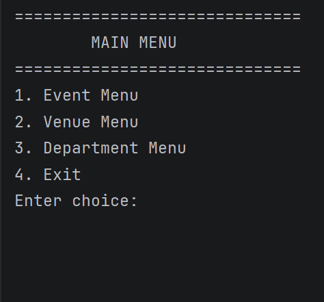
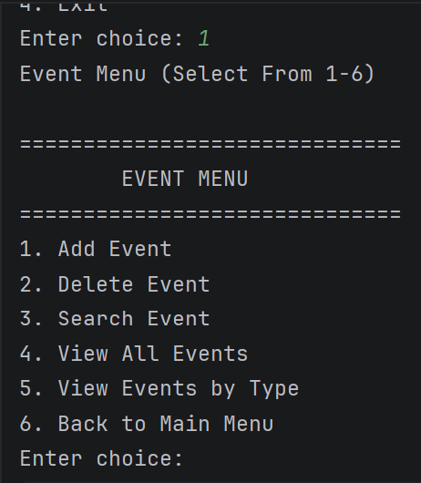
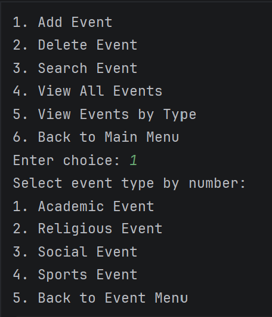

# java-event-management-system

# Event Management System

A Java-based event management application developed for the ICS108 Object-Oriented Programming course at KFUPM.

The project was designed to practice object-oriented programming principles through the implementation of an event management system with GUI-based interaction, event organization, venue management, and input validation.

## Team Information

This project was developed as a two-member team project for the ICS108 Object-Oriented Programming course at KFUPM by Hussain AlSaileek and Alaa AlSaleh.

## Features

- Create and manage events
- User-friendly GUI
- Event search and filtering
- Venue and department management
- Venue-capacity and time-based filtering
- Date and time management implementation and input validation
- Object-oriented class hierarchy design
- Commented and organized code structure

## Screenshots

### Main Menu

### Event Menu

### Event Creation Interface

## Concepts Used

- Object-Oriented Programming (OOP)
- Classes and Objects
- Inheritance
- Encapsulation
- Arrays
- GUI Design
- Input Validation
- Project Organization

## Contributions - Hussain AlSaileek

- Implementing the `Event` class and its subclasses
- Implementing the `EventManager` class
- Implementing the `EventMenu` class
- Developing integer input validation across multiple classes
- Improving user-interface consistency across menu classes
- Ensuring rubric alignment in venue and department management functionality
- Improving and refining the `add` methods in venue and department menus

## What I Learned - Hussain AlSaileek

- Object-oriented programming principles
- Structuring larger Java projects
- GUI-based application development
- Input validation and error handling
- Collaborative development using Git and GitHub
- Writing cleaner and more maintainable code

